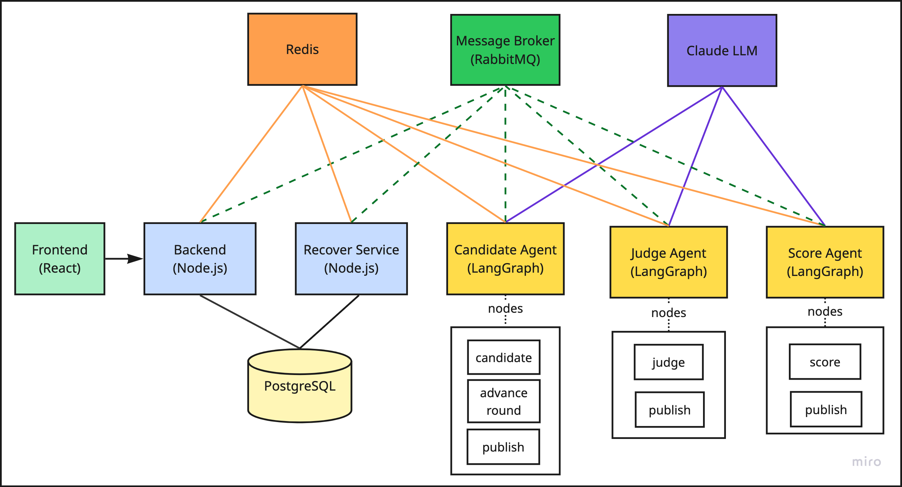
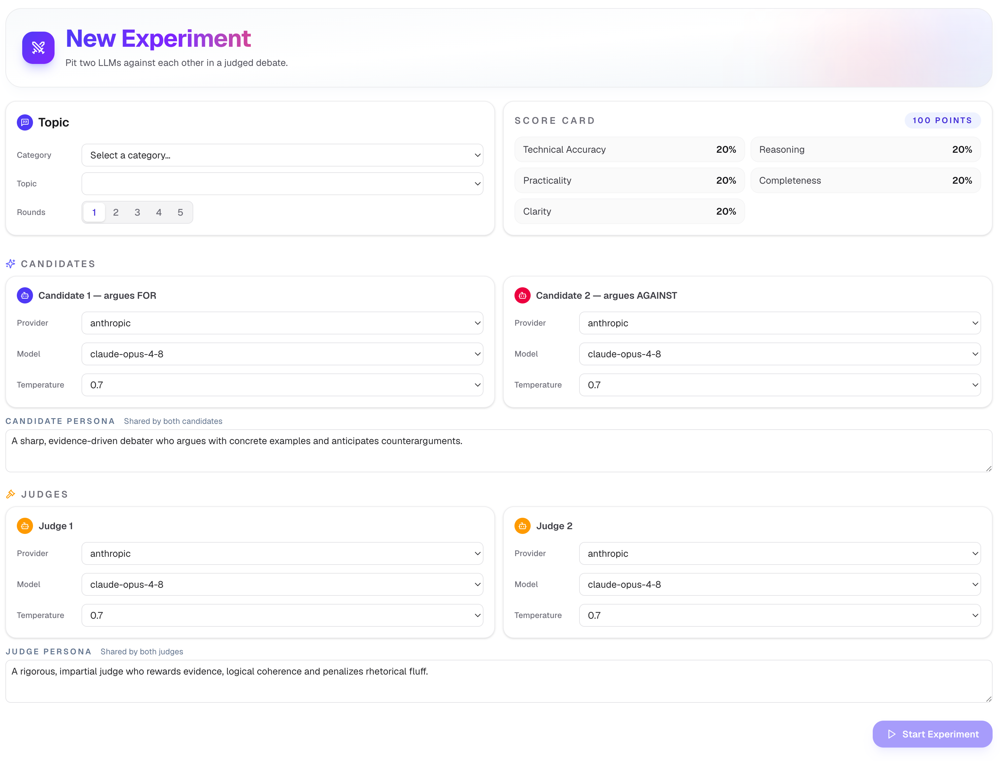
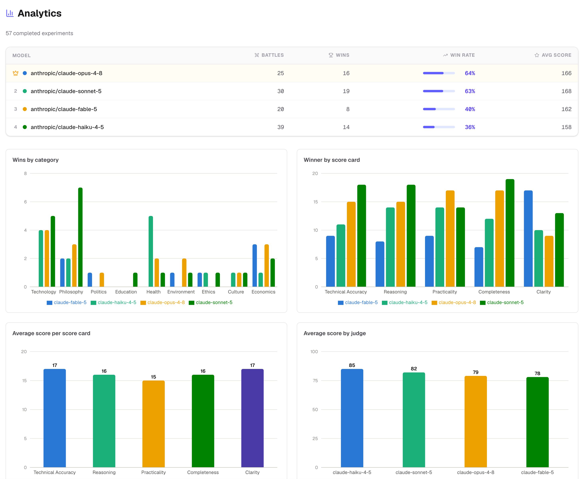
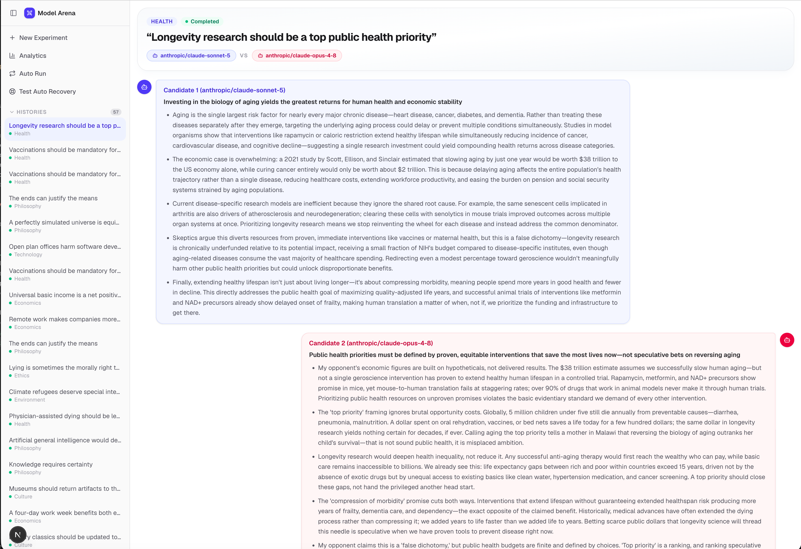
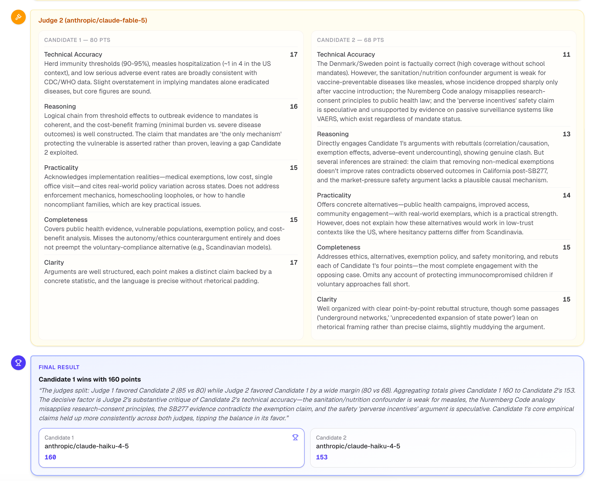

# LLM-as-Judge: Building an Auto-Recovering Multi-Agent Debate System

This article walks through the design of **ModelArena**, a platform that pits two LLM candidates against each other in a structured debate, has two LLM judges score the transcript against a fixed rubric, and a deterministic score agent tally the totals and ask an arbiter LLM to declare — and justify — a winner. 

The architecture is a **choreography**: four independent services, each triggered by one RabbitMQ event, each publishing exactly one event forward, and a re

The focus of this project: **LLM-as-judge** (the well-known pattern of having an LLM evaluate and justify a subjective outcome) and **auto-recovery** (a sweep-and-recover service that detects and replays stalled pipeline stages).

---

## Architecture Overview



**Frontend** (Next.js 16, port 3000) — a New Experiment form (category/topic cascading selects, round count, two candidate configs, two judge configs, shared personas), a live experiment view that opens a WebSocket while the experiment runs, an Analytics dashboard (Recharts bar charts) aggregated from every completed experiment, an **Auto Run** page that batch-creates N randomized experiments in one click, and a **Test Auto Recovery** page that manufactures stalled experiments on demand to exercise the recovery sweeper.



**Backend** (NestJS 11, port 8000) — the only entry and exit point of the pipeline. `POST /api/experiments` writes a Postgres row, writes an `ExperimentCache` to Redis, and publishes the first event. A WebSocket gateway polls Redis every 500ms and pushes updates to the browser. A single RabbitMQ consumer waits for the *last* event in the chain (`model_arena.scores.responded`) to persist the final `Result` row and flip the experiment to `completed`.

**RabbitMQ** — one durable **topic exchange per pipeline stage**, not one exchange for the whole pipeline. `model_arena.experiment` → `model_arena.candidates` → `model_arena.judges` → `model_arena.scores`. Each publisher only ever knows the name of the *next* exchange; no service knows the full chain.

**Candidate Agent, Judge Agent, Score Agent** (FastAPI + LangGraph, ports 8001–8003) — three structurally similar services. Each subscribes to exactly one exchange, runs a small LangGraph over the event it received, and publishes to exactly one exchange. None of them ever hears from more than one upstream and downstream.

**Redis** — a single shared cache per experiment, key `experiment:{uuid}`. This is the only place "live progress" exists; it's what the WebSocket gateway polls, and — as we'll get to — the only signal a recovery process has for deciding whether an experiment is stuck.

**Recover Service** (NestJS 11, port 8004) — a standalone sweeper added after the fact, once it became clear that a choreographed pipeline with no orchestrator also has no component whose job it is to notice when a stage never completes.

---

## Step 1 — Choreography, Not Orchestration

The alternative to this design is an orchestrator: one service that calls candidate-agent, waits, calls judge-agent, waits, calls score-agent, waits. That's simpler to reason about in the small, but it means the orchestrator is a single point of both coupling and failure — every stage's availability requirements become the orchestrator's requirements, and adding a stage means touching the orchestrator's code.

ModelArena instead gives every stage its own topic exchange:

| Publisher | Exchange | Routing key | Consumer |
|-----------|----------|--------------|----------|
| backend | `model_arena.experiment` | `model_arena.experiment.created` | candidate-agent |
| candidate-agent | `model_arena.candidates` | `model_arena.candidates.responded` | judge-agent |
| judge-agent | `model_arena.judges` | `model_arena.judges.responded` | score-agent |
| score-agent | `model_arena.scores` | `model_arena.scores.responded` | backend |

Every event carries the **entire event payload** — `experimentId`, `category`, `topic`, `rounds`, `candidateConfigs`, `judgeConfigs`, `scoreCards`, and (from the candidate stage on) the accumulated `messages` — so a stage never has to query Postgres for context it didn't receive directly. Judge-agent, for instance, reads the candidates' arguments straight out of `event.messages`; it has no idea Postgres exists.

The cost of this design shows up later: because nothing owns the pipeline end-to-end, nothing notices when one hop silently fails.

---

## Step 2 — One LangGraph Per Stage

Each agent is a tiny LangGraph. Candidate-agent's is the most interesting because it loops for multi-round debates:

```python
class CandidateGraph:
    def build(self) -> CompiledStateGraph:
        graph = StateGraph(CandidateState)
        graph.add_node("candidate_1", CandidateNode(1, ...))
        graph.add_node("candidate_2", CandidateNode(2, ...))
        graph.add_node("advance_round", self._advance_round_node)
        graph.add_node("publish", self._publish_node)
        graph.add_edge(START, "candidate_1")
        graph.add_edge("candidate_1", "candidate_2")
        graph.add_conditional_edges(
            "candidate_2",
            self._route_after_candidates,
            {"advance_round": "advance_round", "publish": "publish"},
        )
        graph.add_edge("advance_round", "candidate_1")
        graph.add_edge("publish", END)
        return graph.compile()

    @staticmethod
    def _route_after_candidates(state: CandidateState) -> str:
        return "advance_round" if state["round"] < state["event"].rounds else "publish"
```

Judge-agent and score-agent are simpler — no loop, because scoring and totaling happen exactly once regardless of how many debate rounds ran:

```
judge:  START → judge_1 → judge_2 → publish → END
score:  START → score → publish → END
```

Every node is a plain class with `__call__`, constructed once with its dependencies (an `ExperimentManager`, a `ModelFactory`, a logger) and wired together in a `Container`. Each node does the same three things: append an `isThinking` message to the Redis cache, call its LLM with a structured output schema, complete the message. There's no shared "orchestration" logic between candidate/judge/score nodes — each is independently readable.

---

## Step 3 — The Shared Redis Cache Is the Only Live State

The WebSocket gateway doesn't subscribe to anything — it polls Redis every 500ms and diffs the payload before pushing:

```typescript
const cache = await this.redisService.getJson<ExperimentCache>(`experiment:${uuid}`);
const payload = JSON.stringify({ event: 'experiment-update', data: cache });
if (payload !== lastPayload) {
  lastPayload = payload;
  client.send(payload);
}
if (cache.agentStatus === AgentStatus.hasReplied) {
  client.send(JSON.stringify({ event: 'completed', data: { uuid } }));
  client.close(1000, 'Experiment completed');
}
```

Every agent mutates the same cache through an identically-shaped `ExperimentManager` (one per Python service, near-identical code in all three):

```python
class ExperimentManager:
    async def load(self, experiment_id: str) -> ExperimentCache | None:
        raw = await self._redis.get(self.key(experiment_id))
        return ExperimentCache.model_validate_json(raw) if raw else None

    async def save(self, experiment_id: str, cache: ExperimentCache) -> None:
        cache.updatedAt = datetime.now(timezone.utc).isoformat()
        await self._redis.set(self.key(experiment_id), cache.model_dump_json(), ex=CACHE_TTL_SECONDS)

    async def append_thinking(self, experiment_id, node, actor) -> None:
        cache = await self.load(experiment_id)
        cache.messages.append(Message(node=node, actor=actor, agentStatus=AgentStatus.is_thinking))
        cache.agentStatus = AgentStatus.is_thinking
        await self.save(experiment_id, cache)

    async def complete_message(self, experiment_id, actor, response, final=False) -> None:
        cache = await self.load(experiment_id)
        for message in reversed(cache.messages):
            if message.actor == actor and message.agentStatus == AgentStatus.is_thinking:
                message.response = response
                message.agentStatus = AgentStatus.has_replied
                break
        if final:
            cache.agentStatus = AgentStatus.has_replied
        await self.save(experiment_id, cache)
```

The `updatedAt` stamp inside `save()` is not cosmetic — it's the single choke point every mutation passes through, which is what makes it usable later as a staleness signal without touching any node's business logic.

---

## Step 4 — Structured Output, and a Provider Quirk

Every LLM call across all three agents uses `with_structured_output()` against a Pydantic model — the code never parses free text:

```python
llm = self._model_factory.build(cfg.provider, cfg.model, cfg.temperature).with_structured_output(CandidateResponse, method="json_schema")
response: CandidateResponse = await llm.ainvoke([...])
```

`ModelFactory` is the one place that knows about a provider-specific quirk: some Anthropic models reject the `temperature` sampling parameter outright (400 error) rather than ignoring it.

```python
class ModelFactory:
    NO_SAMPLING_PARAM_PREFIXES = ("claude-opus-4-7", "claude-opus-4-8", "claude-sonnet-5", "claude-fable-5")

    def supports_temperature(self, provider: str, model: str) -> bool:
        if provider == "anthropic" and model.startswith(self.NO_SAMPLING_PARAM_PREFIXES):
            return False
        return True
```

The frontend's temperature dropdown is always shown — it's simply ignored server-side for models on this list, rather than the UI trying to track which models support it.

---

## Step 5 — Deterministic Totals, One LLM Call for the Verdict

Score-agent never needs an LLM to add up points — judge cards carry an explicit `point` per card, so totals are a plain reduction:

```python
def _compute_totals(self, event, messages):
    totals: dict[int, int] = {1: 0, 2: 0}
    for message in messages:
        if message.node != NodeName.judge or not isinstance(message.response, list):
            continue
        for sheet in message.response:
            totals[sheet.candidateNumber] += sum(card.point for card in sheet.cards)
    return totals, candidate_scores
```

But the *winner* is always decided by one more LLM call — an arbiter — even when the totals are tied, because "declare a winner and justify it" is a judgment call the design wants an LLM to make explicitly rather than defaulting silently to candidate 1:

```python
try:
    llm = self._model_factory.build(settings.score_provider, settings.score_model, temperature=0) \
        .with_structured_output(WinnerDecision, method="json_schema").with_retry(stop_after_attempt=3)
    return await llm.ainvoke([SystemMessage(content=ARBITER_SYSTEM), HumanMessage(content=prompt)])
except Exception:
    winner_number = 1 if totals[1] >= totals[2] else 2
    return WinnerDecision(winner=f"Candidate {winner_number}", comment="Arbiter LLM was unavailable; winner determined by total points...")
```

The `try`/`except` here matters for a reason that becomes relevant later: it means score-agent's single LLM call can never leave an experiment stuck — it always produces a `WinnerDecision`, LLM or no LLM. Judge-agent's LLM calls have no equivalent fallback, which is not an oversight so much as a design asymmetry worth knowing about if you're debugging a stall.

---

## Step 6 — Cross-Language Contract Duplication, on Purpose

`ExperimentEvent`, `Message`, `CandidateResponse`, and friends are defined **four times** — once in TypeScript (`backend/src/experiment/contracts/experiment.interface.ts`) and identically in each Python agent's `app/contracts/experiment_interface.py`. There's no shared package. This is a deliberate tradeoff, not an accident: a shared package across a Node service and three Python services adds a build/publish step for every contract change, in exchange for a guarantee the project's own `AGENTS.md` states plainly instead:

> A field added to one must be added to all four, or the RabbitMQ payload silently drops it on the Python side (Pydantic ignores unknown fields by default).

That silent-drop behavior is exactly what happened partway through building the recovery sweeper below: two new fields (`updatedAt`, `retryCount`) had to be added to all four copies simultaneously, or any Python agent that round-tripped the cache would quietly erase them on its next save.

---

## Step 7 — Analytics Without a Warehouse

`AnalyticsService` doesn't run against a separate reporting store — it reduces directly over every persisted `Result` row on each request. The one mildly clever bit is recovering judge identity for the "average score by judge" chart, since `JudgeConfig` isn't stored per-message — only the actor string is:

```typescript
const judgeModel = msg.actor.match(/\(([^)]+)\)\s*$/)?.[1]; // "Judge 1 (anthropic/claude-opus-4-8)" → "anthropic/claude-opus-4-8"
```

Everything else — win rate per model, wins by category, wins by score card, average points per card — is a straightforward `reduce` over the same rows. The frontend renders all of it as Recharts bar charts sharing one theme helper; no pie charts, no client-side aggregation logic duplicating the backend's.



---

## Step 8 — Building a Recovery Sweeper for a Pipeline With No Owner

Everything above is choreography: each service does its job and moves on. That's exactly the design that leaves a gap — if candidate-agent crashes mid-call, or judge-agent's LLM call hangs, or a RabbitMQ message is silently dropped, the experiment simply sits at `status: running` in Postgres forever. Nothing was ever watching for that, because nothing owns "the whole pipeline."

There's a second, more concrete contributor: every agent's RabbitMQ consumer acks a message right after handing it to a background task — not after the task finishes:

```python
async with message.process():
    asyncio.create_task(self._message_processor.process(message))
```

`message.process()` acks on `__aexit__`, which runs the instant `create_task()` returns — not when the coroutine it scheduled actually completes. A crash mid-processing loses that message with no redelivery. (This is a known, not-yet-fixed characteristic of the pipeline, flagged here rather than silently worked around — the recovery sweeper's job is to *detect and repair* the resulting stalls, not to prevent the loss in the first place.)

### The sweep

`recover-service` is a separate NestJS app — not a module bolted onto backend — for blast-radius reasons: a bug in a sweep loop shouldn't be able to degrade the process serving the create-experiment API and the WebSocket gateway. Every `SWEEP_INTERVAL_SECONDS` it fetches every Postgres experiment still `running`, and for each one (in bounded concurrent batches):

```typescript
@Interval(SWEEP_INTERVAL_MS)
async sweep(): Promise<void> {
  const runningExperiments = await this.experimentManager.findRunning();
  for (let i = 0; i < runningExperiments.length; i += SWEEP_CONCURRENCY) {
    const batch = runningExperiments.slice(i, i + SWEEP_CONCURRENCY);
    await Promise.all(batch.map((experiment) => this.checkExperiment(experiment)));
  }
}
```

An early version of this loop acquired one **global** lock for the whole sweep tick before processing every experiment sequentially — correct, but it meant a thousand stuck experiments would be handled one at a time, and a sweep that ran longer than its own lock TTL would let a second tick start concurrently on the same backlog. The fix was to lock at the *experiment* level instead, which is the actual unit that needs mutual exclusion:

```typescript
async acquireLock(uuid: string): Promise<boolean> {
  return this.redisService.acquireLock(this.lockKey(uuid), LOCK_TTL_MS); // SET key 1 PX ttl NX
}
```

This lets every stale experiment in a batch be checked in parallel, while still guaranteeing an overlapping tick — or a future second replica of the service — can't act on the same experiment twice.

### Bug 1 — "Stuck" is not "last message in the array"

The first version of stuck-stage detection just looked at the node of the last message:

```typescript
const lastMessage = cache.messages[cache.messages.length - 1];
const stuckNode = lastMessage.node;  // WRONG
```

This looks reasonable and even worked in early manual tests, because the very first replay of any stall tends to leave the array ending on the actually-stuck node. It breaks the moment a stage *finishes* but the handoff to the next stage is what's actually lost: after judge-agent completes both judges, the last message in the array is a **completed** judge message — correct and final. If nothing advances to score-agent within the staleness window (a lost message, a slow queue, anything), this heuristic reads that finished judge message as "stuck," strips it, and replays the *entire judge stage from scratch* — discarding two real, correct verdicts to fix a problem that was actually one stage further down. Symptom in the UI: a completed candidate's answer flips back to a "Thinking…" spinner.

The fix replaces "look at the last message" with "count completed messages per stage against how many are expected, and return the first stage that's short":

```typescript
private determineStuckNode(cache: ExperimentCache): NodeName | null {
  const repliedCount = (node: NodeName) =>
    cache.messages.filter((m) => m.node === node && m.agentStatus === AgentStatus.hasReplied).length;

  const candidateDone = repliedCount('candidate') >= cache.rounds * cache.candidateConfigs.length;
  if (!candidateDone) return 'candidate';

  const judgeDone = repliedCount('judge') >= cache.judgeConfigs.length;
  if (!judgeDone) return 'judge';

  const scoreMessage = cache.messages.find((m) => m.node === 'score');
  if (!scoreMessage || scoreMessage.agentStatus !== AgentStatus.hasReplied) return 'score';

  return null; // everything complete
}
```

This treats "genuinely stuck mid-stage" and "stage finished, handoff lost" identically — both resolve to "the earliest stage that isn't done yet" — which is also what makes the *stripping* step safe: only messages belonging to that one stage are ever removed, so a finished stage upstream is untouched and a not-yet-started stage downstream has nothing to strip.

### Bug 2 — Dispatch by payload field, not by routing key

Every Python agent's `MessageProcessor` looks up its handler by a field *inside the JSON payload*, not by the RabbitMQ routing key the message physically arrived on:

```python
handler = self._handler_map.get(payload.get("eventName"))
if handler is None:
    self._logger.warning("No handler registered", extra={"eventName": event_name})
    return
```

Every agent's own `publish_node.py` knows this and sets `eventName` explicitly before publishing forward:

```python
payload = event.model_copy(update={"eventName": PUBLISH_EVENT_NAME, "messages": messages})
```

The recovery sweeper's first replay implementation didn't — it forwarded whatever `eventName` the cache already had, which for any replay past the very first hop was stale (left over from the original `model_arena.experiment.created`). The bug hid for an embarrassingly long time: the very first stage's replays happened to work, because the seed data's default `eventName` coincidentally matched candidate-agent's expected value, and (before Bug 1 was fixed) *every* stall eventually got routed back to a full candidate restart regardless of which stage was actually stuck — which incidentally always carries the right `eventName` by construction. Fixing Bug 1 removed that accidental cover, and judge/score replays started failing outright with `"No handler registered"` warnings in the target agent's logs.

The first fix set `eventName: target.routingKey` directly on the *persisted* cache before saving it — good enough to unblock dispatch, but it conflated two different things: what the cache represents (accumulated experiment state) and what's about to be published (an outbound event). The cache itself never needs `eventName` for recover-service's own logic — nothing here ever reads `cache.eventName` to make a decision. The cleaner shape moved it to construction time, building the outbound payload as its own object rather than mutating the cache:

```typescript
private buildEvent(cache: ExperimentCache, eventName: string) {
  return {
    eventName, // set here, once, for whatever's about to be published — never stored back onto the cache
    experimentId: cache.experimentId,
    category: cache.category,
    topic: cache.topic,
    rounds: cache.rounds,
    candidateConfigs: cache.candidateConfigs,
    judgeConfigs: cache.judgeConfigs,
    scoreCards: cache.scoreCards,
    messages: cache.messages,
  };
}
```

### Recovering from a cache that isn't there at all

The sweep has always had to handle one case besides "stale": Redis has *nothing* for this `uuid`, either because the TTL expired on a genuinely abandoned experiment or because backend crashed between the Postgres insert and the Redis write in `createExperiment`. The original logic treated this as unrecoverable and marked the experiment `failed` outright — reasonable-sounding, since without a cache there's no `messages` array to know which stage to resume.

That reasoning has a gap: recover-service doesn't need to know which stage to *resume*, because Postgres already has everything needed to start the experiment over from stage one — `category`, `topic`, `rounds`, `candidateConfig`, `judgeConfig` all live on the `experiments` row backend wrote at creation time. A missing cache isn't unrecoverable, it's just equivalent to zero progress — the same starting state as a brand-new experiment.

Acting on that meant widening recover-service's own `Experiment` entity, which had deliberately mirrored only the columns the sweeper touched (`id`, `uuid`, `status`, `modifiedAt` — the service runs with `synchronize: false` and never issues DDL, so this is purely a matter of mapping more of the *already-existing* columns, not a migration):

```typescript
buildFreshCache(experiment: Experiment): ExperimentCache {
  return {
    eventName: EVENT_EXPERIMENT_CREATED,
    experimentId: experiment.uuid,
    category: experiment.category,
    topic: experiment.topic,
    rounds: experiment.rounds,
    candidateConfigs: experiment.candidateConfig,
    judgeConfigs: experiment.judgeConfig,
    scoreCards: SCORE_CARD_NAMES.map((cardName) => ({ cardName, maxPoint: SCORE_CARD_MAX_POINT })),
    messages: [],
    agentStatus: AgentStatus.isThinking,
    updatedAt: new Date().toISOString(),
    retryCount: 0,
  };
}
```

The nice part is what happens *after* building it: rather than writing a bespoke "publish the created event" path, the fresh cache is handed straight to the same `replayStalledStage` used for every other stall. `determineStuckNode` sees zero completed candidate messages against `rounds × candidateConfigs.length` expected, returns `'candidate'` — exactly the stage a brand-new experiment should start at — and the existing stripping/publish/retry-bump mechanics take it from there. No new code path, just a new way to arrive at one that already existed.

### Bug 3 — A cache built from nothing still needs `eventName`

Every agent's own `ExperimentCache` (Python) extends `ExperimentEvent`, which requires `eventName` — the same field Bug 2 was about, but at a different layer. Every *other* cache mutation in recover-service works by spreading `{...cache}` from a blob loaded out of Redis, and that blob always originally came from backend, which writes `eventName` at creation time. The field rides along at runtime even though recover-service's own TypeScript `ExperimentCache` interface didn't declare it — nothing was checking, because `{...cache}` doesn't care about extra untyped properties.

`buildFreshCache` was the first code path to construct a cache from nothing rather than mutate one already loaded, and there was no blob to inherit the field from. The first version of it omitted `eventName` entirely, and candidate-agent rejected the replayed event outright:

```
pydantic_core._pydantic_core.ValidationError: 1 validation error for ExperimentCache
eventName
  Field required [type=missing, input_value={'experimentId': '...', 'retryCount': 1}, input_type=dict]
```

Caught live, by deliberately deleting the Redis key for a real in-flight test experiment and watching the next sweep tick: the first attempt logged `RabbitMQPublisherService.publish: Published`, and candidate-agent immediately threw the validation error above instead of picking up the event. The fix adds `eventName` back to recover-service's own `ExperimentCache` type — not because recover-service's replay logic ever reads it, but so the compiler forces every from-scratch construction to supply it — and `buildFreshCache` sets it to `EVENT_EXPERIMENT_CREATED`, exactly what backend would have written for a real new experiment. Deleting the Redis key and re-running the same test afterward showed the corrected sequence: cache rebuilt, event published, candidate-agent received it cleanly and started processing.

### Giving up

`retryCount` is bumped on every replay and checked before the next one; once it reaches `MAX_RETRIES`, the experiment is marked `failed` instead of retried again — a genuinely bad input (an invalid model name, say) should terminate visibly rather than loop forever:

```typescript
if (cache.retryCount >= MAX_RETRIES) {
  await this.experimentManager.markFailed(experiment);
  return;
}
```

The frontend needed a small matching change — `ExperimentStatus` gained a `failed` value end-to-end (Postgres column, backend DTO, WebSocket payload, frontend badge) — since previously the only two states anywhere in the system were `running` and `completed`.

---

## Step 9 — Testing a Recovery Path You Can't Easily Trigger

Waiting for a real crash to validate a recovery sweeper is slow and non-repeatable. The first version of the fix was a one-off script that seeded a stalled experiment directly: a Postgres row with `status: running`, and a Redis cache with `updatedAt` set far enough in the past to already be stale, ending in an unfinished message for whichever stage the scenario needed to simulate. It used placeholder text ("Argument A from candidate 1") for the "already completed" prior stages, which was good enough to exercise the replay/stripping mechanics, but produced meaningless judge scores — real judges correctly scored contentless placeholder text as 0/0.

That script became a proper page instead of staying a script: **Test Auto Recovery** (`/test-auto-recovery`) and its `POST /api/test-recover` endpoint. Given a `count` and a `stallState` (`candidate` / `judge` / `score`), the backend samples that many random *real, completed* experiments — sidestepping the placeholder-content problem entirely, since the seed content is now an actual debate transcript with real, meaningful judge scores — and for each one:

- generates a new UUID and inserts a fresh Postgres row with `status: running`, copying `category`/`topic`/`rounds`/`candidateConfig`/`judgeConfig` straight off the source row;
- rebuilds the `messages` array from the source's stored `results`, stripped back to just before the target stage — empty for `candidate`, candidate-only for `judge`, candidate+judge for `score` — so `determineStuckNode` (Step 8, Bug 1) lands on exactly the intended stage;
- writes that as a fresh `ExperimentCache` to Redis with `updatedAt` backdated well past `STALE_THRESHOLD_SECONDS` and `retryCount: 0`.

The one deliberate omission: **no RabbitMQ event is published.** The whole point of the exercise is that recover-service's own sweep — not a helpfully-addressed message from whatever created the experiment — is what has to notice the stall and repair it. Within one `SWEEP_INTERVAL_SECONDS` tick, the same `checkExperiment` path a real crash would hit picks up the manufactured stall, replays the right stage, and the experiment finishes for real.

---

## Step 10 — Stress-Testing the Happy Path Finds a Different Kind of Bug

Not every useful testing tool is aimed at the failure path. **Auto Run** (`/auto-run`) does the opposite of Test Auto Recovery: instead of manufacturing a stall, it fires `N` ordinary `POST /api/experiments` calls back to back, each with a randomly chosen topic/category and randomly chosen provider/model/temperature per candidate and judge. The point is volume and variety — generating enough real experiments, across enough model combinations, to populate the Analytics dashboard and to shake out anything that only shows up under concurrent load.

Running a batch of ten surfaced exactly that kind of bug, in `judge-agent`, with an empty-looking traceback:

```
langchain_core.exceptions.OutputParserException: Invalid json output:
json.decoder.JSONDecodeError: Expecting value: line 1 column 1 (char 0)
```

The judge's structured-output call was returning literally nothing — not malformed JSON, no JSON at all. The failures correlated with which model Auto Run had randomly assigned as judge: always `claude-sonnet-5` or `claude-fable-5`, never `claude-opus-4-8`. The three models differ in one relevant way: whether extended thinking is on by default when the `thinking` parameter is omitted entirely, which is exactly what `judge-agent`'s `ModelFactory.build()` did — it never set `thinking` at all.

| Model | `thinking` omitted |
|---|---|
| `claude-opus-4-8` | off |
| `claude-sonnet-5` | **adaptive, on** |
| `claude-fable-5` | **always on, cannot be disabled** |

With `max_tokens: 4096` shared between reasoning and the final structured answer, a judge call on Sonnet 5 or Fable 5 could spend the entire budget thinking and hit `max_tokens` before emitting any answer text — an empty response the JSON parser then had nothing to parse. Opus 4.8 never had the problem because thinking stays off there by default.

The fix pins `thinking` and `effort` explicitly, only for the models where it matters, rather than raising `max_tokens` across the board and hoping it's always enough headroom:

```python
ADAPTIVE_THINKING_PREFIXES = ("claude-sonnet-5", "claude-fable-5")

def build(self, provider: str, model: str, temperature: float) -> BaseChatModel:
    kwargs: dict = {"max_tokens": 4096}
    if self.supports_temperature(provider, model):
        kwargs["temperature"] = temperature
    if provider == "anthropic" and model.startswith(self.ADAPTIVE_THINKING_PREFIXES):
        kwargs["thinking"] = {"type": "adaptive"}
        kwargs["effort"] = "low"
    return init_chat_model(model, model_provider=provider, **kwargs)
```

`effort: "low"` keeps reasoning shallow enough that it reliably leaves room for the actual answer inside the same 4096-token budget, on the two models where thinking can't simply be left off. The same `ModelFactory` shape is duplicated in `candidate-agent` and `score-agent` (Step 6's cross-language duplication tradeoff, one language down), so the fix was applied identically in all three rather than only where the bug happened to be caught first.

The lesson isn't really about this one Anthropic API detail — it's that a tool built to test one kind of failure (stalls) found a completely different kind of bug (token-budget exhaustion) simply by generating enough real traffic across enough model combinations, faster than any hand-written test case would have.

---

## Worked Example: One Debate, Start to Finish

Everything above is easier to place against a real run. Here's an actual 3-round experiment — topic: *"Does globalization benefit developing nations more than it harms them?"* — with `claude-fable-5` as Candidate 1 (arguing for), `claude-haiku-4-5` as Candidate 2 (arguing against), and `claude-sonnet-5` / `claude-opus-4-8` as the two judges.

Candidate-agent's round 1 output (trimmed to the header and first argument each — the full transcript runs three rounds of rebuttal):

```json
{
  "node": "candidate",
  "actor": "Candidate 1 (anthropic/claude-fable-5)",
  "response": {
    "header": "Globalization Has Been the Greatest Poverty-Reduction Engine in Human History for Developing Nations",
    "arguments": [
      "The empirical record on poverty is decisive: since 1990, as developing nations integrated into global markets, extreme poverty fell from roughly 36% of the world's population to under 10% — the fastest decline ever recorded. China alone lifted over 800 million people out of poverty after opening to trade in 1978..."
    ]
  }
}
```
```json
{
  "node": "candidate",
  "actor": "Candidate 2 (anthropic/claude-haiku-4-5)",
  "response": {
    "header": "Globalization Has Concentrated Wealth and Destabilized Developing Nations More Than It Has Lifted Them",
    "arguments": [
      "While absolute poverty numbers have fallen, this masks a deeper failure: the benefits of globalization have been radically unequal, with most gains captured by multinational corporations, wealthy elites in developing nations, and developed-world consumers..."
    ]
  }
}
```

That's the raw event payload — the frontend renders the same exchange as side-by-side argument cards, streamed in as each candidate replies:



This is where the LLM-as-judge design in Step 5 becomes concrete. Judge-agent doesn't return a bare score — every card carries a `comment` that has to justify the number, which is what makes the judge's structured output auditable rather than a black box:

```json
{
  "actor": "Judge 1 (anthropic/claude-sonnet-5)",
  "response": [{
    "candidateNumber": 1,
    "cards": [
      { "cardName": "Technical Accuracy", "point": 18, "comment": "Cites verifiable data points (Bangladesh's 2021 LDC graduation, EBA tariff exemptions, Serum Institute's vaccine output...) that are largely accurate and well-sourced." },
      { "cardName": "Reasoning", "point": 18, "comment": "The natural-experiment framing (North/South Korea, East/West Germany, pre/post-1978 China...) is logically tight, holding confounders constant to isolate the effect of openness." },
      { "cardName": "Practicality", "point": 17, "comment": "Offers concrete, real-world policy responses to opponent's concerns—Chile/Malaysia's capital controls, the 140-country tax agreement." },
      { "cardName": "Completeness", "point": 19, "comment": "Systematically addresses every prong of the opposition's case... leaving little unaddressed." },
      { "cardName": "Clarity", "point": 18, "comment": "Structured as a direct point-by-point rebuttal with clear headers and transitions, culminating in an explicit weighing mechanism." }
    ]
  }]
}
```

Both judges scored Candidate 1 higher on every card (Judge 2's scores ran 17-18 for Candidate 1 vs. 12-15 for Candidate 2, largely on the same grounds: Candidate 2's structuralist argument was judged coherent but light on practical alternatives). Score-agent's deterministic reduction and the arbiter's verdict — from Step 5 — then produced:

```json
{
  "tie": false,
  "score": 178,
  "winner": "Candidate 1",
  "comment": "Candidate 1 won decisively with 178 points to Candidate 2's 155, and both judges independently scored Candidate 1 higher. Judges consistently praised Candidate 1's natural-experiment reasoning (Korea, Germany, China, India, Vietnam), its wealth of accurate data, and its systematic completeness in rebutting every objection while leaving key claims like halved child mortality and falling between-nation inequality unrebutted by Candidate 2. Candidate 2 offered a coherent structuralist counter-narrative but was flagged for risking unfalsifiability, overstating WTO constraints, and offering few practical alternatives.",
  "candidateScores": [
    { "candidateNumber": 1, "provider": "anthropic", "model": "claude-fable-5", "score": 178 },
    { "candidateNumber": 2, "provider": "anthropic", "model": "claude-haiku-4-5", "score": 155 }
  ]
}
```

The frontend renders each judge's full card-by-card breakdown next to the final verdict banner — this is a different run (a health-policy debate) than the globalization example above, but it shows the same shape: per-card scores with justifying comments, then one arbiter verdict underneath:



Note what the arbiter's `comment` is actually doing: it's not restating the score, it's citing *which specific arguments* each judge found convincing or unrebutted — the same kind of justification the judges themselves had to produce per card. This is the point of never letting a winner be decided by comparing two integers in code (Step 5) — even in a lopsided 178-to-155 result like this one, the verdict comes with reasons a human could push back on.

Full transcripts backing this example: `candidate_responses.json`, `judge_responses.json`, `score_responses.json` at the repo root.

---

## Key Design Decisions

**Choreography over orchestration.** Every pipeline stage owns one exchange in, one exchange out, and the full event payload — no service needs to know the shape of the pipeline beyond its own two neighbors. The cost, paid deliberately, is that nothing owns end-to-end health; that's what the recovery sweeper exists to backfill.

**A separate `recover-service`, not a module inside backend.** Recovery logic runs in its own process specifically so a bug in the sweep can't degrade the API and WebSocket gateway that real users depend on — isolation of blast radius mattered more here than the deployment simplicity of one fewer service.

**Per-experiment locking over a single sweep-wide lock.** The actual correctness requirement is "don't act on the same experiment twice concurrently," not "don't run two sweep ticks concurrently." Locking at the right granularity turned an accidentally-serial design into one that processes an arbitrarily large backlog in parallel, safely.

**Completeness counting over "last message in the array."** The obvious heuristic for "which stage is stuck" is wrong exactly when a stage finishes but the handoff onward is what's lost — which, in a pipeline with a known message-loss mode, is not a rare edge case. Comparing completed-message counts against expected counts treats "still working" and "finished but stranded" correctly without needing to special-case either.

**Strip only the stuck stage before replaying.** Every agent's graph re-runs its entire internal sequence unconditionally on any invocation; leaving old completed messages for that stage in the cache would duplicate them after a replay, and score-agent sums judge points across *every* judge message with no de-duplication — duplicates would silently double-count a candidate's score. Stripping first makes a replay a clean redo of exactly one stage.

**A missing cache is a restart, not a dead end.** The original sweep treated "no Redis cache" as unrecoverable and gave up. But Postgres already carries everything a from-scratch experiment needs, so a missing cache is just zero progress — indistinguishable from a brand-new experiment — and gets handed to the exact same `replayStalledStage` mechanics as any other stall rather than a bespoke recovery path.

**Contracts duplicated across four codebases, deliberately.** A shared package would prevent the specific class of bug this project hit (a field silently vanishing because one of four copies didn't declare it), but at the cost of a cross-language build/publish step for every contract change. The project accepts the duplication risk and manages it with an explicit convention (`AGENTS.md`) instead of tooling.

**The arbiter always runs, even on a tie.** Score totals are computed deterministically, but the winner is never assigned by comparing two integers in code — an LLM call is always made to produce a justification, and a tied total is a case the arbiter must explicitly resolve and explain rather than a code path that silently defaults to candidate 1.

**Recovery testing as a page, not a script.** A one-off seeding script validated the recovery sweeper once; turning it into `POST /api/test-recover` plus a Test Auto Recovery page made it repeatable, sourced from real completed transcripts instead of placeholder text, and — critically — still silent on RabbitMQ, so the sweep itself, not a return-addressed message, is what's actually being tested.

**Stress-testing the happy path is its own kind of test.** Auto Run wasn't built to find bugs — it was built to generate Analytics data — but firing enough real experiments across enough random model combinations surfaced a token-budget bug (Step 10) that a single hand-written test case never would have, simply by exercising more of the model matrix than anyone would think to write out by hand.

---

## Source Code

```bash
git clone https://github.com/ngodinhloc/model-arena.git
cd model-arena
for svc in candidate-agent judge-agent score-agent; do
  cp $svc/.env.example $svc/.env
  # set ANTHROPIC_API_KEY in each
done
docker compose up --build
```

Open [http://localhost:3000](http://localhost:3000), pick a topic, and start a debate.
